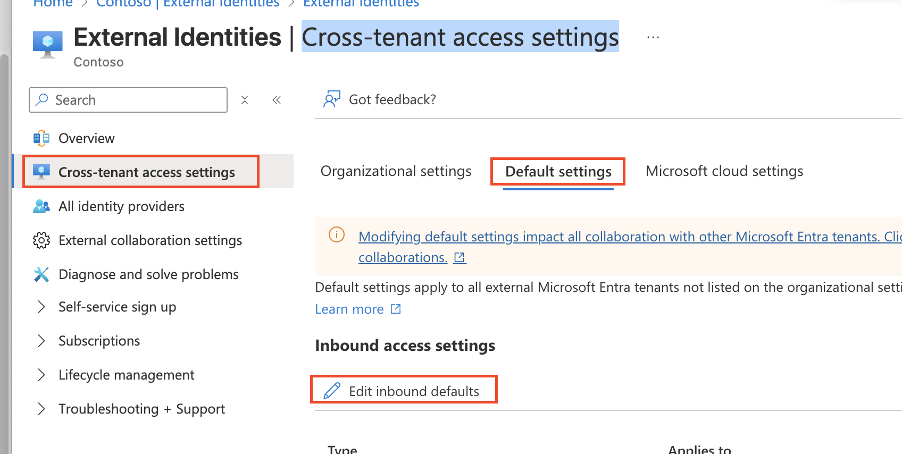
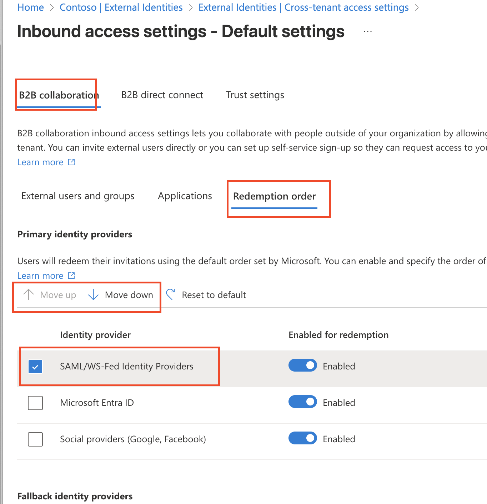
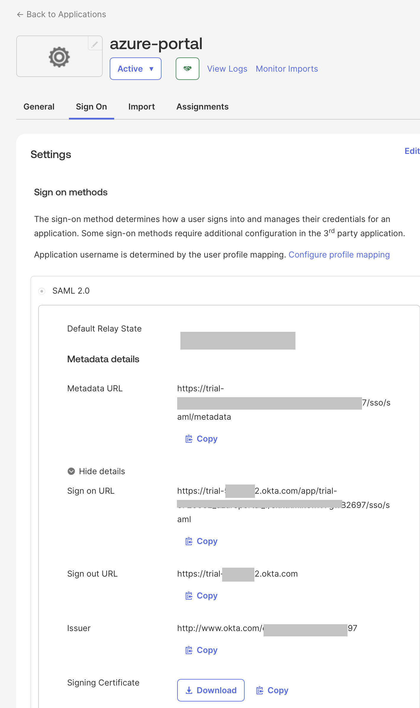
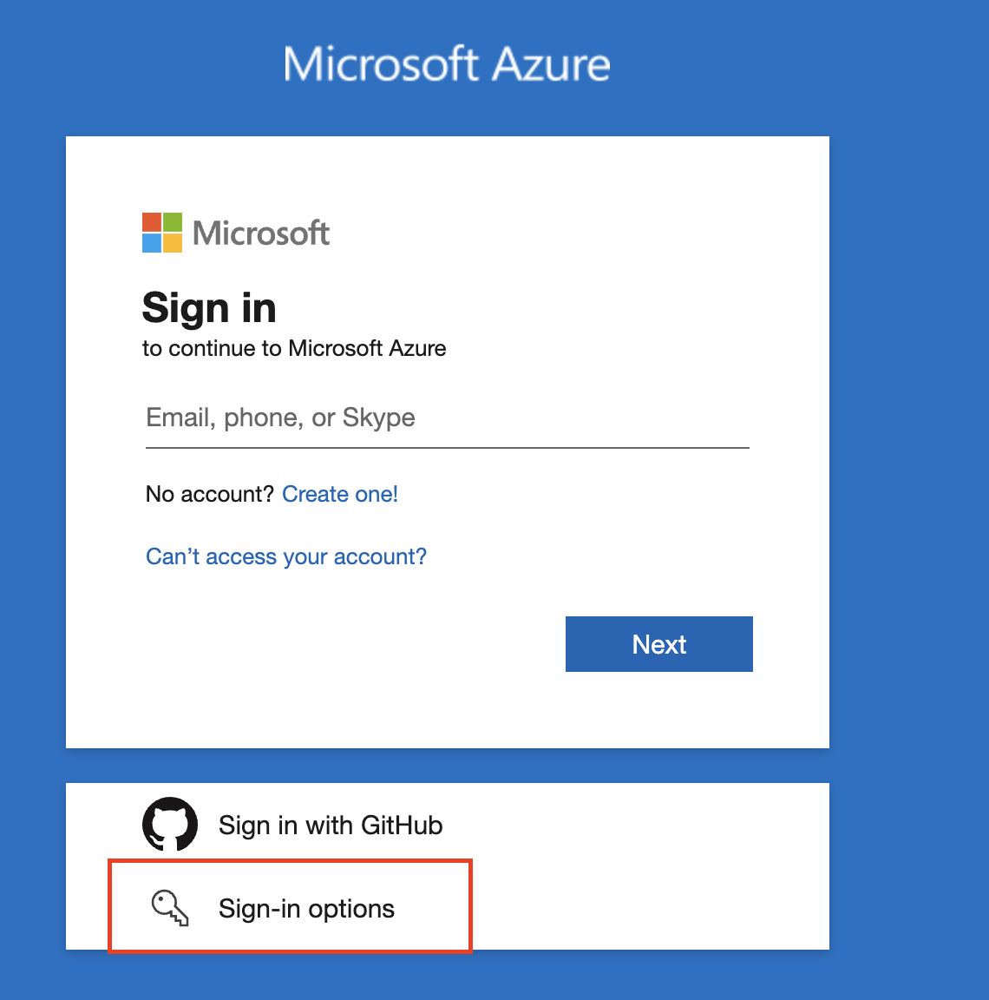
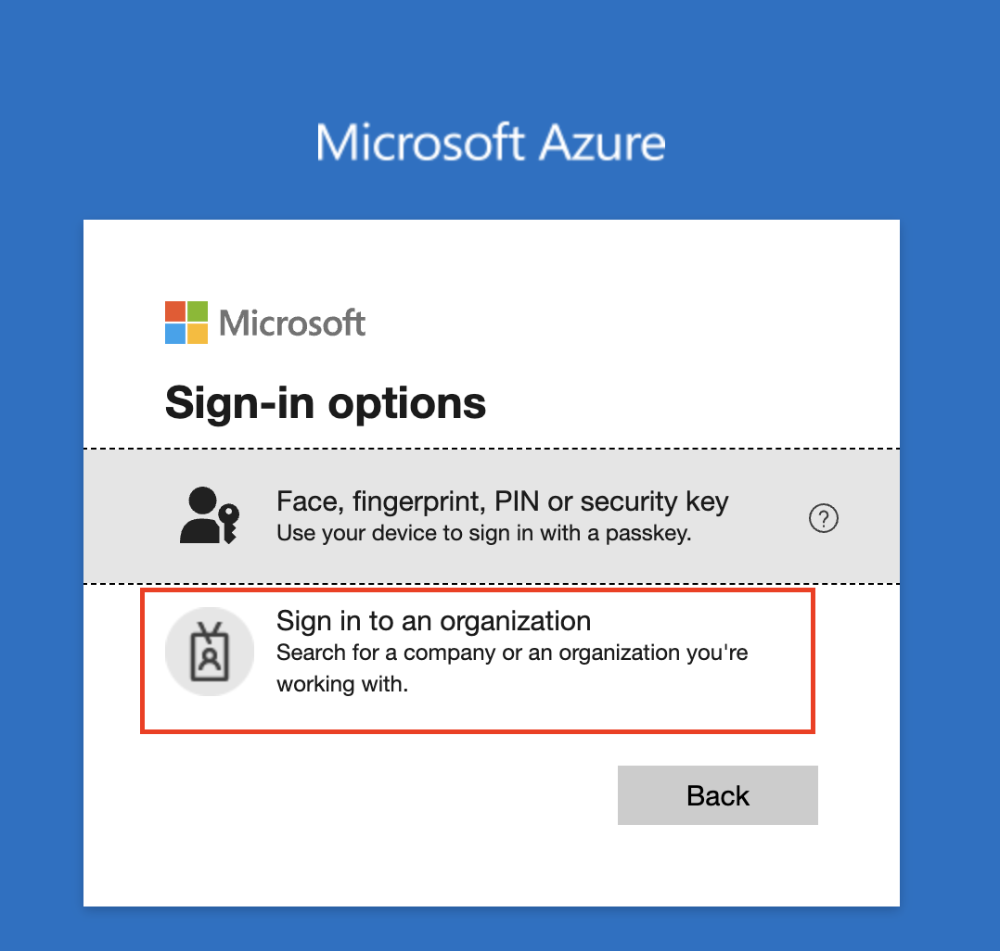
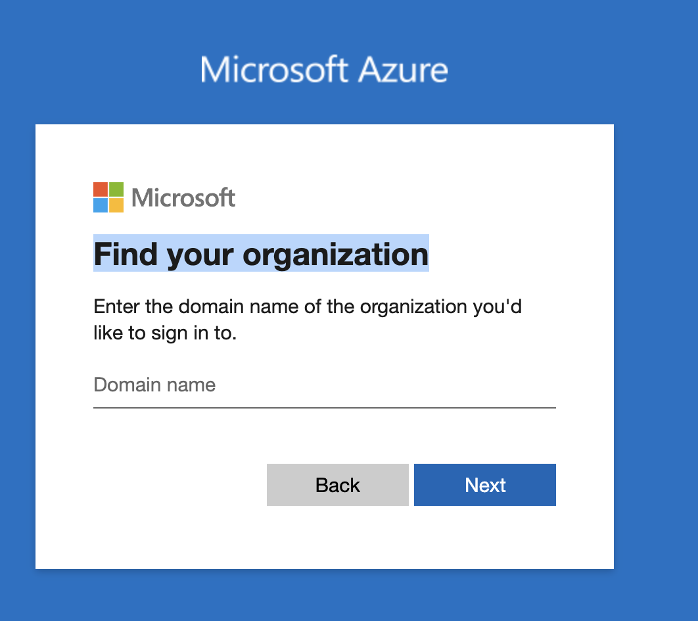
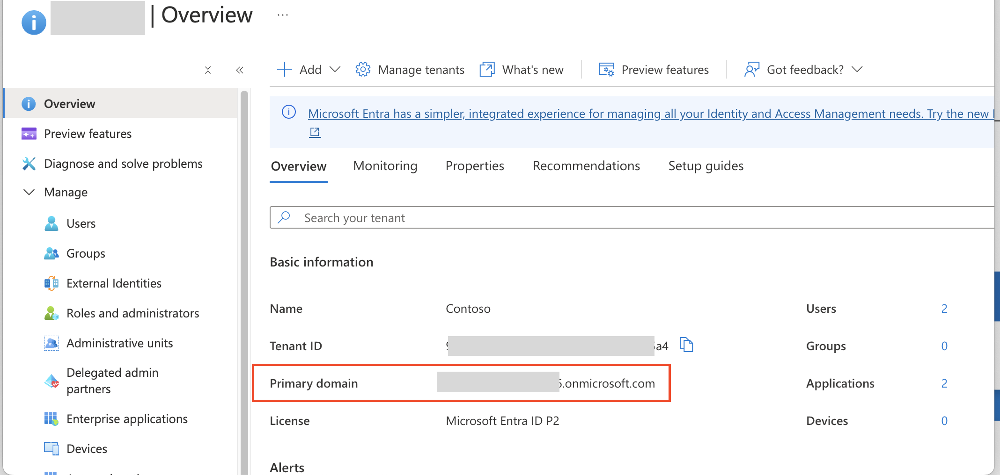
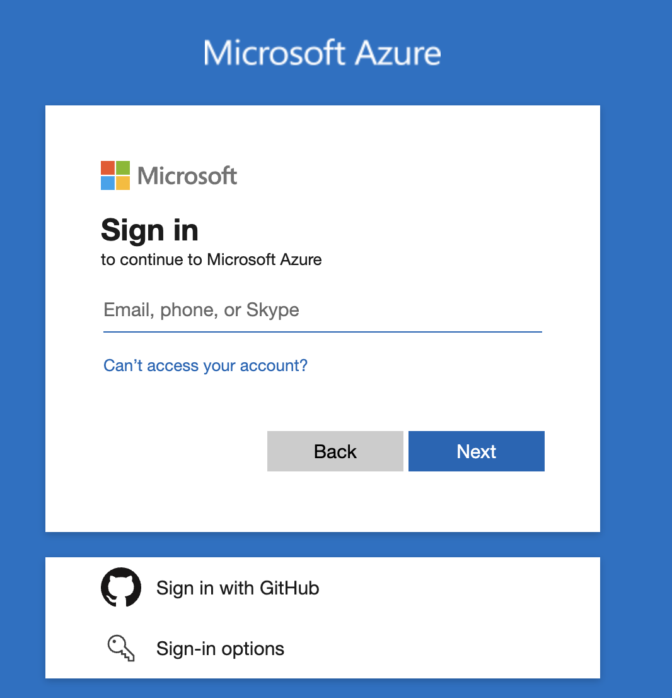

# Azure B2B External ID with Okta SAML Integration Guide

This guide provides step-by-step instructions for setting up Azure B2B External ID with Okta as a SAML identity provider for external business partners and organizations.

## Prerequisites

- Azure AD Premium P1 or P2 licensing
- Azure AD tenant with External ID B2B features enabled
- Okta administrator access
- Domain ownership verification for both Azure and Okta

## Overview

Azure B2B External ID enables secure collaboration with external business partners, vendors, and organizations. By integrating with Okta as a SAML identity provider, external users can authenticate using their existing Okta credentials while accessing your Azure AD-protected resources.

## Part 1: Configure Okta SAML Application

### Step 1: Create SAML Application in Okta

1. **Access Okta Admin Console**
   - Log in to your Okta admin console
   - Navigate to `Applications` > `Applications`

2. **Create New Application**
   - Click `Create App Integration`
   - Select `SAML 2.0`
   - Click `Next`

3. **General Settings**
   - **App name**: `Azure External ID`
   - **App logo**: Upload your organization logo (optional)
   - Click `Next`

### Step 2: Configure SAML Settings

1. **Single Sign-On URL**
   ```
   https://login.microsoftonline.com/login.srf
   ```

2. **Audience URI (SP Entity ID)**
   ```
   urn:federation:MicrosoftOnline
   ```

3. **Default RelayState**: Leave blank (optional)

4. **Name ID Format**: `Persistent`

5. **Application Username**: `Azure AD UserPrincipalName`

### Step 3: Configure Attribute Statements

Add the following attribute mappings for Azure B2B:

| Name | Name Format | Value |
|------|-------------|-------|
| `http://schemas.xmlsoap.org/ws/2005/05/identity/claims/emailaddress` | URI Reference | `user.email` |
| `http://schemas.xmlsoap.org/ws/2005/05/identity/claims/givenname` | URI Reference | `user.firstName` |
| `http://schemas.xmlsoap.org/ws/2005/05/identity/claims/surname` | URI Reference | `user.lastName` |
| `http://schemas.xmlsoap.org/ws/2005/05/identity/claims/name` | URI Reference | `user.displayName` |

### Step 4: Complete Okta Configuration

1. Click `Next`
2. Select `I'm an Okta customer adding an internal app`
3. Click `Finish`

### Step 5: Download Metadata

1. Go to the `Sign On` tab of your newly created application
2. Right-click on `Identity Provider metadata` link
3. Save the XML file for later use in Azure configuration

## Part 2: Configure Azure B2B External ID

### Step 6: Access Azure AD External Identities

1. **Access Azure Portal**
   - Navigate to [Azure Portal](https://portal.azure.com)
   - Search for `Azure Active Directory`
   - Select `External Identities` from the left menu

2. **Verify B2B Settings**
   - Click on `External collaboration settings`
   - Ensure B2B collaboration is enabled
   - Configure guest user permissions as needed

### Step 7: Add Direct Federation with Okta

1. **Navigate to Identity Providers**
   - In External Identities, go to `All identity providers`
   - Click `+ New SAML/WS-Fed IdP`

2. **Configure SAML Identity Provider**
   - **Domain name**: Enter the domain of your partner organization (e.g., `partner.com`) <br>
   **NOTE:** if the Domain is already EntraID verified, make sure to adjust the **Redemption order** of IdP to make sure SAML is in higher priority. To adjust the order, in **EntraID** -> **External Identities** -> **Cross-tenant access settings**, select **Redemption order** and adjust order accordingly.
  
   - **Protocol**: Select `SAML`
   - **Select a method for populating metadata**: input metadata manually
   - to find out values to fill, visit okta admin page, "Application", then select the application you just create, navidate to **"Sign On"** tab, in **"SAML"** 2.0 section, you can find most of the value you need:
   
   - **Passive authentication endpoint**: Copy from application SAML **Sign on URL**, which `https://<okta domain id>.okta.com/app/trial-xxxxx_azureportal_1/xxxx/sso/saml`
   - **Issuer URI**: Copy from **Issuer**
   - **Certificate**: Copy from **Signing Certificate**

3. **Save Configuration**
   - Click `Save` to create the direct federation

### Step 8: Configure Cross-Tenant Access Settings (Optional)

1. **Navigate to Cross-tenant access settings**
   - In External Identities, go to `Cross-tenant access settings`
   - Click `+ Add organization`

2. **Add Partner Organization**
   - Enter the partner's Azure AD tenant ID or domain
   - Configure inbound and outbound access settings
   - Set trust settings for MFA and device compliance

### Step 9: Test Direct Federation

1. **Invite External User**
   - Navigate to `Users` > `All users`
   - Click `+ New user` > `Invite external user`
   - Enter email address from the federated domain
   - Send invitation

2. **Test Authentication Flow**
   - External user receives invitation email
   - User clicks on invitation link
   - User is redirected to Okta for authentication
   - Upon successful authentication, user is redirected back to Azure AD
   - For normal login process, make sure you specify organization to login
   , enter domain of your EntraID, which can be found in EntraID overview, then you will be prompt to enter identity again, make sure you entered the account match to **domain** you set in SAML domain. for ex. if your SAML settig is for xyz.com, then only when identity is under the same domain, ex,  test@xyz.com, will direct to SAML login you just configured. You can set multuple domains for the same SAML config though.

## Troubleshooting

### Common Issues and Solutions

1. **Direct Federation Not Working**
   - Verify the domain is correctly configured in Azure AD
   - Check that the Okta metadata URL is accessible
   - Ensure the domain matches the user's email domain

2. **SAML Response Signature Validation Failed**
   - Verify the signing certificate is correctly configured
   - Check that the certificate hasn't expired
   - Ensure clock synchronization between Azure AD and Okta

3. **User Cannot Accept Invitation**
   - Verify the user's email domain matches the federated domain
   - Check that direct federation is properly configured
   - Ensure the user doesn't already exist as a member user

4. **Guest User Permissions Issues**
   - Review guest user permissions in External collaboration settings
   - Check application-specific permissions and roles
   - Verify conditional access policies aren't blocking access

### Debugging Steps

1. **Enable Logging**
   - Turn on sign-in logs in Azure AD
   - Review audit logs for external identity activities
   - Monitor Okta system logs for SAML requests

2. **Test with SAML Tracer**
   - Use browser extensions to trace SAML requests/responses
   - Validate assertion content and signatures
   - Check for any claim mapping issues

3. **Verify Direct Federation Status**
   - Check the status of direct federation in Azure AD
   - Test with a known working user from the federated domain
   - Validate the partner organization configuration

## Security Considerations

1. **Certificate Management**
   - Regularly rotate signing certificates
   - Monitor certificate expiration dates

2. **Network Security**
   - Implement proper firewall rules
   - Use HTTPS for all communications

3. **User Lifecycle**
   - Plan for guest user deprovisioning
   - Implement guest user access reviews
   - Set up automated guest user cleanup policies
   - Monitor guest user activity and compliance

## Monitoring and Maintenance

1. **Regular Health Checks**
   - Monitor guest user sign-in success rates
   - Set up alerts for direct federation configuration changes
   - Review guest user access patterns and compliance

2. **Performance Monitoring**
   - Track authentication latency for external users
   - Monitor SAML response times from Okta
   - Track guest user onboarding and activation rates

## Conclusion

This B2B integration provides seamless authentication for external business partners while maintaining security and governance. Direct federation with Okta eliminates the need for external users to create separate Azure AD accounts, improving user experience and reducing administrative overhead.

## Additional Resources
- [Add federation with SAML/WS-Fed identity providers](https://learn.microsoft.com/en-us/entra/external-id/direct-federation#step-1-determine-if-the-partner-needs-to-update-their-dns-text-records)

- [Integration of Okta as an IdP for Microsoft Azure AD B2B](https://www.linkedin.com/pulse/integration-okta-idp-microsoft-azure-ad-b2b-carlos-segura-vidal-juope)

- [Azure AD B2B External Identities Documentation](https://docs.microsoft.com/en-us/azure/active-directory/external-identities/)
- [Direct Federation with SAML/WS-Fed Identity Providers](https://docs.microsoft.com/en-us/azure/active-directory/external-identities/direct-federation)
- [Okta SAML Configuration Guide](https://help.okta.com/en-us/Content/Topics/Apps/Apps_App_Integration_Wizard_SAML.htm)
- [Azure AD B2B Best Practices](https://docs.microsoft.com/en-us/azure/active-directory/external-identities/b2b-fundamentals)